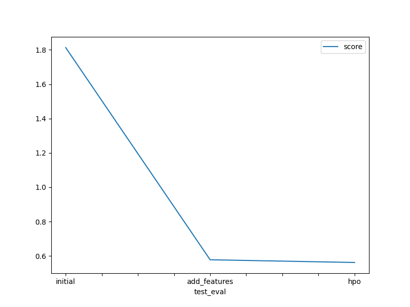

# Report: Predict Bike Sharing Demand with AutoGluon Solution
#### Divi Eswar Chowdary

## Initial Training
### What did you realize when you tried to submit your predictions? What changes were needed to the output of the predictor to submit your results?
Clip Negative Values to Zero

### What was the top ranked model that performed?
WeightedEnsemble_L3

## Exploratory data analysis and feature creation
### What did the exploratory analysis find and how did you add additional features?
Based on EDA,found that there is normal distribution among temp,atemp ...
So, Added them as Categorical Values based on thresholds.
Correlation graph showed the high correlation between month and seasonality around 0.97.removed month from dataframe.
Used datetime column to extract indiviual Day,time,month

### How much better did your model preform after adding additional features and why do you think that is?
After adding the additional features,i observed a huge increment in kaggle Score between two. Incorporating domain knowledge to include relevant features can improve the accuracy of predictions.

## Hyper parameter tuning
### How much better did your model preform after trying different hyper parameters?
The Kaggle score saw a slight improvement following adjustments made to the hyperparameters.

### If you were given more time with this dataset, where do you think you would spend more time?
In order to develop an efficient model, allocating ample time towards feature engineering and hyperparameter tuning is essential.

### Create a table with the models you ran, the hyperparameters modified, and the kaggle score.
|    model     |               hpo1              |                                               hpo2                                              |                                           hpo3                                          |  score  |
|:------------:|:------------------------------:|:-------------------------------------------------------------------------------------------------:|:----------------------------------------------------------------------------------------:|:-------:|
|    initial   |             default            |                                             default                                            |                                           default                                        | 1.81338 |
| add_features |             default            |                                             default                                            |                                           default                                        | 0.57776 |
|      hpo     | scheduler: local, searcher: random | 'CAT': {'iterations': 8000},'RF': {'n_estimators': 250},'XT': {'n_estimators': 250} | GB: num_boost_round=100, num_leaves(lower=26, upper=66, default=36) | 0.56189 |

### Create a line plot showing the top model score for the three (or more) training runs during the project.

TODO: Replace the image below with your own.

### Create a line plot showing the top kaggle score for the three (or more) prediction submissions during the project.

TODO: Replace the image below with your own.

## Summary
Throughout this project, we have followed key steps in the Machine Learning (ML) lifecycle.

The problem at hand involves effectively utilizing data generated by bike sharing systems and external factors to gain business advantages for firms. The business objective is to predict bike sharing demand using relevant data.

To obtain the necessary data, we utilized the "Bike Sharing Demand" Kaggle competition dataset.

We began our analysis by using libraries such as Pandas, Matplotlib, and Seaborn to describe, visualize, and modify the data.

For building our models, we leveraged the Autogluon AutoML library. Initially, we created a model without any preprocessing, but later we built models with additional features and tuned hyperparameters.

In order to evaluate the accuracy of the models, we tested them by submitting predictions to Kaggle and compared performance based on scores obtained.